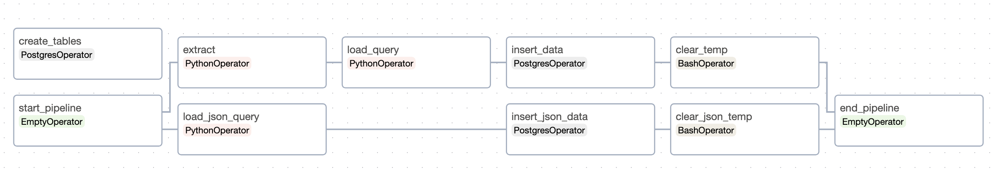
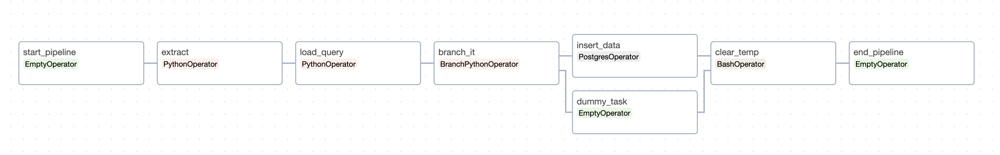
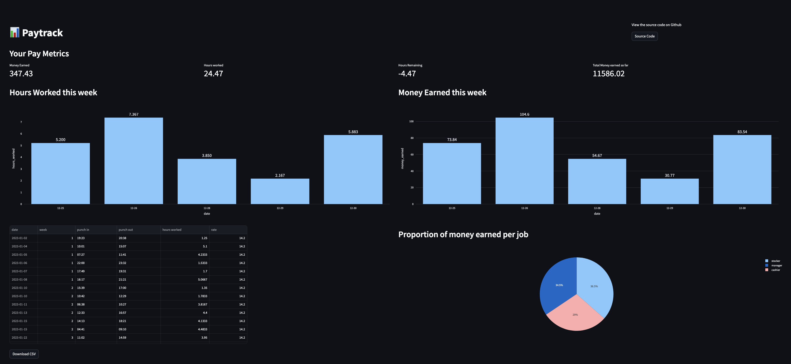
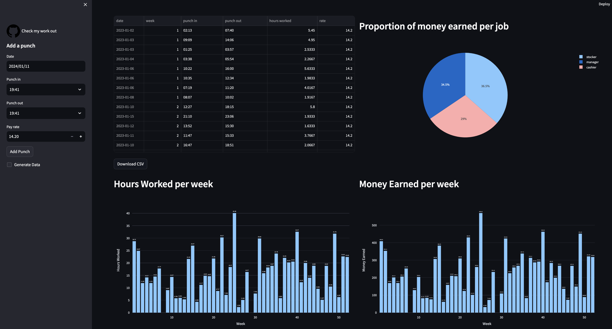

# PayTrack - README

## Data Engineering Project - Personal Work Hours Tracking and Visualization

### Project Overview

This data engineering project aims to assist a graduate student (the user) who works part-time, in tracking and visualizing their work hours for better management. While the college provides a website with basic work-hour data, the user decided to create a solution that extracts, stores, and visualizes additional insights.

### Project Objectives

The primary objectives of this project include:

1. **Data Extraction**: Develop a process to collect work hours data from the Kronos website using its API.

2. **Data Storage**: Create and maintain a relational database to securely store the extracted data.

3. **Data Transformation**: Implement necessary procedures for data cleaning, validation, and standardization.

4. **Dashboard Creation**: Generate a Streamlit dashboard for visualizing work hours data.

### Project Components

#### 1. Data Extraction

A script or program interacts with the Kronos API to extract work hours data, including date, clock-in time, and clock-out time.

#### 2. Database Management

A relational database (Postgres on Docker) is used to store the extracted data, maintaining data integrity.

#### 3. Data Transformation

Procedures are implemented to clean, validate, and standardize the extracted data.

#### 4. Dashboard Generation

A real-time Streamlit dashboard displays work hours data, providing insights into trends, hours worked, and relevant metrics.

### Project Benefits

This project offers the following benefits:

- Efficiently tracks work hours.
- Provides data visualization for better insights.
- Facilitates better management of part-time work.

### Data Source

- API: Kronos API to extract work hours data
- JSON: Backed-up JSON file containing work hours data from 2023-2024

### DataBase

- Database: Postgres on Docker

### DAGS

#### catchup

This DAG extracts data from the source API, creates tables in the database, and loads the data into the tables. It is typically run once for every user to extract available data from the API and load it into the database.

#### update punches

This DAG extracts punches data from the source API and updates the database with new data for every user on a daily basis.

### Dashboard

- Dashboard: Streamlit dashboard to visualize data from the database.
- Dashboard is updated in real-time with data from the database.
- Dashboard initial view:

The dashboard initially shows fake generated data, but the user can log in using credentials to view their data. (Currently, the dashboard is not deployed on a server, so the user can only view the dashboard locally after running the catchup DAG with their credentials)

### Usage

To run the project, simply execute `docker-compose up`.